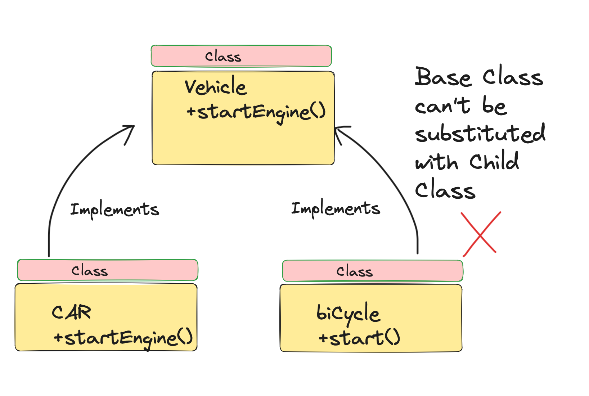
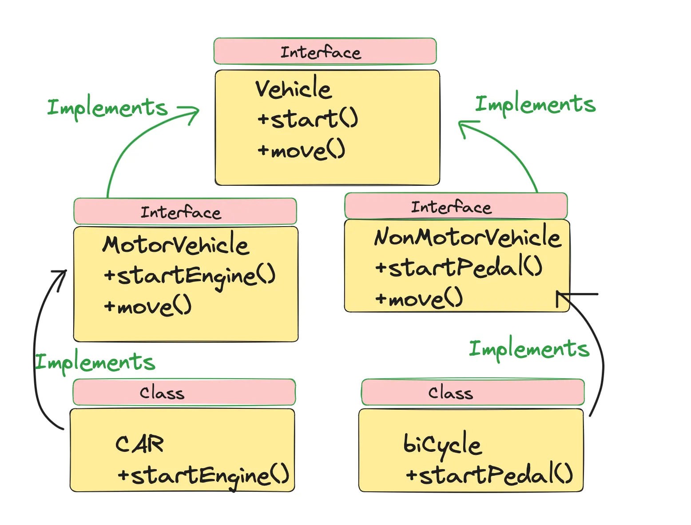
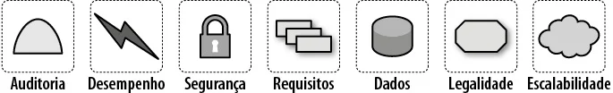
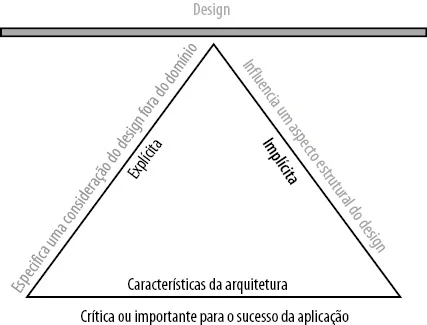

# Aula 1 - Apresentação da Disciplina e Introdução a DAS-I

## Objetivo da Disciplina
Estudar princípios e padrões arquiteturais para desenvolvimento de sistemas bem estruturados, com foco em manutenibilidade e escalabilidade.

## Padrões Arquiteturais

### MVC (Model-View-Controller)
- Separação da aplicação em três camadas
- Model: Gerencia dados e regras de negócio
- View: Interface do usuário
- Controller: Intermedia requisições entre Model e View

### Arquitetura Monolítica
- Sistema único com todos os componentes integrados
- Desenvolvimento mais simples inicialmente
- Pode apresentar desafios de escalabilidade

### Arquitetura Orientada a Serviços
- Sistema composto por serviços independentes
- Comunicação via APIs bem definidas
- Maior flexibilidade e capacidade de evolução

## Benefícios dos Padrões Arquiteturais
- Organização do código
- Facilidade de manutenção
- Escalabilidade controlada
- Separação de responsabilidades

## Próximos Tópicos
Cada padrão arquitetural será detalhado em aulas subsequentes com exemplos práticos e estudos de caso.

# 31/07/2025 - Arquitetura de Código
*Baseada no livro "Engenharia de Software Moderna"*

## Contexto do Livro
O livro "Engenharia de Software Moderna" aborda práticas contemporâneas de desenvolvimento, enfatizando a importância de fundamentos sólidos em arquitetura de código para construir sistemas sustentáveis e escaláveis.

## Abstração
Estratégia fundamental para reduzir a complexidade de software através da representação simplificada de elementos do mundo real em código. Permite focar nos aspectos essenciais ignorando detalhes irrelevantes.

**Hierarquia de Abstrações:**
- **Entidade**: Representação de elementos do domínio real com identidade única
- **Repositório**: Abstração de operações de persistência e acesso a dados
- **Serviço**: Abstração da lógica de negócios e orquestração
- **Controlador**: Abstração de endpoints e interface com clientes externos

## Complexidade em Software
Dificuldade inerente em compreender, modificar e manter um sistema devido a múltiplos fatores: quantidade de elementos, interdependências, falta de clareza estrutural e acoplamento excessivo. Pode ser classificada em:

- **Complexidade Acidental**: Resultante de más decisões de design
- **Complexidade Essencial**: Inerente ao problema sendo resolvido

## Boas Práticas em Desenvolvimento Orientado a Objetos

- **Padrões de Nomenclatura**: Seguir convenções estabelecidas pela linguagem (camelCase, PascalCase, snake_case)
- **Uso de Frameworks**: Aproveitar estruturas consolidadas para padronização e produtividade
- **Estruturas de Dados Adequadas**: Selecionar coleções e tipos apropriados para cada contexto
- **Princípios SOLID**: Aplicar diretrizes para design orientado a objetos coeso

## Estradas Pavimentadas
Conceito que defende a utilização de soluções já validadas pela indústria, baseado na premissa de que reinventar a roda é custoso e arriscado.

**Vantagens:**
- Economia de tempo e recursos financeiros
- Redução de riscos através de soluções testadas
- Acesso a conhecimentos e melhores práticas consolidadas
- Foco em diferenciais competitivos ao invés de problemas já resolvidos

## Ocultamento de Informação
Princípio implementado através do encapsulamento que protege os detalhes internos de implementação, expondo apenas interfaces bem definidas.

**Benefícios:**
- **Desenvolvimento Paralelo**: Equipes podem trabalhar independentemente em módulos encapsulados
- **Flexibilidade a Mudanças**: Implementações internas podem evoluir sem impactar consumidores
- **Facilidade de Entendimento**: Redução da carga cognitiva através de interfaces simplificadas
- **Manutenibilidade**: Isolamento de mudanças e prevenção de efeitos colaterais

## Getters e Setters
Mecanismos que implementam o encapsulamento controlando o acesso aos atributos internos de uma classe. Permitem:

- Validação de dados na entrada
- Controle de estado interno consistente
- Flexibilidade para alterar implementação sem quebrar contratos
- Adição de lógica auxiliar (logging, notificações)

# 04/08/2025 - Coesão, Acoplamento e SOLID

## Coesão
Princípio que define que uma classe deve conter apenas o código necessário para executar uma única responsabilidade de forma completa.

### Vantagens da Coesão
- Facilita implementação e entendimento da classe
- Simplifica manutenção e testes
- Permite reúso mais eficiente
- Facilita atribuição de responsabilidades na equipe

### Separação de Interesses
Princípio relacionado que defende que uma classe deve implementar apenas um interesse específico do domínio.

## Acoplamento
Grau de interdependência entre classes e componentes do sistema.

### Tipos de Acoplamento
**Aceitável:**
- Dependência via interfaces estáveis
- Uso de métodos públicos bem definidos

**Ruim:**
- Dependência de implementações instáveis
- Uso de variáveis globais ou arquivos compartilhados

### Classificações
- **Acoplamento Estrutural**: Dependências explícitas no código
- **Acoplamento Evolutivo**: Propagação de mudanças entre componentes

### Benefícios do Baixo Acoplamento
- Maior estabilidade do sistema
- Flexibilidade para modificações
- Melhor testabilidade dos componentes

## Princípios SOLID
Conjunto de cinco princípios para design de software orientado a objetos.

### S - Single Responsibility Principle
Uma classe deve ter apenas uma razão para mudar.

### O - Open/Closed Principle
Entidades devem ser abertas para extensão, mas fechadas para modificação.

### L - Liskov Substitution Principle
Classes derivadas devem ser substituíveis por suas classes base.

### I - Interface Segregation Principle
Múltiplas interfaces específicas são melhores que uma interface única.

### D - Dependency Inversion Principle
Dependa de abstrações, não de implementações concretas.

# 07/08/2025 - SOLID
*Baseada no livro "Código Limpo" e Padrões de Projeto*

---

## Contexto
O conceito de **SOLID** reúne cinco princípios fundamentais de design de software orientado a objetos.  
Esses princípios têm como objetivo principal facilitar a compreensão, o desenvolvimento e a manutenção de sistemas.  
Segui-los significa construir aplicações mais organizadas, escaláveis e com menor acoplamento.

---

## Princípios SOLID

### 1. Single Responsibility Principle (Princípio da Responsabilidade Única)
Cada classe ou módulo deve possuir apenas uma responsabilidade, evitando misturar funções que não pertencem à mesma lógica.  

**Exemplo prático:** Utilizar o padrão **MVC**, onde:  
- **Model** cuida dos dados,  
- **View** da interface,  
- **Controller** da lógica de interação.

---

### 2. Open/Closed Principle (Princípio do Aberto/Fechado)
As entidades de software devem estar abertas para extensão, mas fechadas para modificação.  
Isso significa que novas funcionalidades devem ser adicionadas sem alterar código já existente.

---

### 3. Liskov Substitution Principle (Princípio da Substituição de Liskov)
Objetos de subclasses devem poder substituir objetos da classe base sem afetar o funcionamento correto do programa.

---

### 4. Interface Segregation Principle (Princípio da Segregação de Interfaces)
Interfaces devem ser específicas e coesas.  
Evita-se a criação de interfaces “inchadas” que obrigam classes a implementar métodos desnecessários.  

---

### 5. Dependency Inversion Principle (Princípio da Inversão de Dependência)
Módulos de alto nível não devem depender de módulos de baixo nível, ambos devem depender de **abstrações**.  
A ideia é sempre depender de **interfaces** ao invés de implementações concretas.

---

## Conteúdo Abordado na Aula
- Responsabilidade Única  
- Segregação de Interfaces  
- Referência ao livro **Código Limpo**  
- Padrões de Projeto como apoio na aplicação dos princípios  

---

## Exemplo Prático em Java (Swing)

### Classe Janelinha
```java
package br.univille;

import javax.swing.JButton;
import javax.swing.JFrame;

public class Janelinha extends JFrame {

    private JButton botaozinho;
    private Controlador controlador;

    public Janelinha() {
        setTitle("Janelinha");
        setDefaultCloseOperation(JFrame.EXIT_ON_CLOSE);
        setSize(500,500);

        controlador = new Controlador();

        botaozinho = new JButton(" Me Clica ");
        botaozinho.addActionListener(controlador);
        botaozinho.addMouseMotionListener(controlador);

        add(botaozinho);
        setVisible(true);
    }

    public static void main(String[] args) {
        new Janelinha();
    }
}


### Classe Controlador

```java
package br.univille;

import java.awt.event.ActionEvent;
import java.awt.event.ActionListener;
import java.awt.event.MouseEvent;
import java.awt.event.MouseMotionListener;
import javax.swing.JOptionPane;

public class Controlador 
    implements ActionListener, 
        MouseMotionListener {

    @Override
    public void actionPerformed(ActionEvent e) {
        JOptionPane.showMessageDialog(null, "EU NAO ACREDITO");
    }

    @Override
    public void mouseDragged(MouseEvent e) {
        // Implementação vazia
    }

    @Override
    public void mouseMoved(MouseEvent e) {
        System.out.println("Moveu" + " x:" + e.getX() + " y:" + e.getY());
    }
}
```

---

## Conclusão

A aplicação prática dos princípios **SOLID** garante maior qualidade de código.
Nesta aula, destacamos:

* A importância da **responsabilidade única** e da **segregação de interfaces**
* Como o uso de **MVC** e de **interfaces** ajuda a aplicar esses conceitos
* O suporte de padrões de projeto para manter código limpo, organizado e extensível

**Referência:** Livro *Código Limpo* e Padrões de Projeto.


# 11/08/2025 - SOLID
*Baseada no livro "Código Limpo" e referências de Bertrand Meyer*

---

## Capítulo 1 - Princípio de Inversão de Dependências
Em vez de o código depender diretamente de implementações concretas (como classes específicas), ele deve depender de abstrações (como interfaces).  

**Benefícios:**
- Facilita substituição de implementações  
- Reduz acoplamento  
- Aumenta a flexibilidade e a manutenibilidade do sistema  

---

## Capítulo 2 - Princípio Prefira Composição a Herança
Este princípio recomenda priorizar o uso de **composição** em detrimento da **herança**.  

### Herança:
- Cria forte acoplamento entre classes  
- Expõe detalhes internos  
- Pode gerar herança de comportamentos indesejados ou incorretos  

### Composição:
- Permite flexibilidade, inclusive alteração em tempo de execução  
- Evita dependência excessiva entre classes  
- Reduz efeitos colaterais em mudanças  

**Resumo:**  
A herança deve ser usada somente quando duas classes **filhas** realmente compartilham uma relação clara com a classe **pai** e não fazem sentido sem essa hierarquia.  

---

## Capítulo 3 - Princípio de Demeter (Menor Conhecimento)
Também chamado de **Lei de Demeter** ou princípio do menor conhecimento.  

### Regras:
Um método deve invocar apenas:
- Métodos da sua **própria classe**  
- Métodos de objetos recebidos como **parâmetro**  
- Métodos de objetos **criados internamente**  
- Métodos de **atributos** da própria classe  

**Objetivo:**  
Evitar o acoplamento excessivo e a dependência em cadeias longas de chamadas.  

---

## Capítulo 4 - Open/Closed Principle (Aberto/Fechado)
Defendido por **Bertrand Meyer** na década de 80.  
Diz que **uma classe deve estar fechada para modificações, mas aberta para extensões.**  

### Exemplos de aplicação:
- Uso de **interfaces** para possibilitar múltiplas implementações  
- Aplicação de **padrões de projeto** como Strategy e Template Method  

**Resumo:**  
Esse princípio incentiva a construção de classes flexíveis e extensíveis, que se adaptam a diferentes cenários sem necessidade de alterar o código-fonte existente.  

---

## Conclusão da Aula
Nesta aula (11/08/2025) aprendemos:  
- O **princípio da inversão de dependências**, essencial para reduzir acoplamento  
- O motivo de **preferir composição a herança** em busca de maior flexibilidade  
- Como aplicar o **princípio de Demeter** para evitar cadeias de chamadas complexas  
- O fundamento do **princípio Aberto/Fechado**, que sustenta extensibilidade sem modificar código existente  

Esses conceitos reforçam os pilares de **SOLID**, garantindo código limpo, organizado e preparado para evoluir.  

# Aula 14/08/2025 - SOLID
*Baseada nos livros "Padrões de Projeto", "Engenharia de Software Moderna" e referências do site Design Patterns Guru*

---

## Capítulo 1 - Liskov Substitution Principle (Princípio de Substituição de Liskov)

"Se S é um subtipo de T, então objetos do tipo T em um programa podem ser substituídos por objetos do tipo S sem alterar nenhuma das propriedades desejáveis do programa (correção, tarefas realizadas, etc.)."  
— **Barbara Liskov**

Esse princípio estabelece que uma subclasse deve ser capaz de substituir sua superclasse sem quebrar o comportamento esperado do sistema.  
Se isso não for possível, significa que a herança foi aplicada de maneira incorreta.

---

## Capítulo 2 - Exemplo de má implementação

No exemplo abaixo, **Carro** e **Bicicleta** são ambos considerados **Veículos**.  
Porém, se a classe `Veiculo` define que todo veículo deve ter um **motor**, a **Bicicleta** não pode implementar corretamente essa lógica, pois não possui motor.  

Isso quebra o princípio de Liskov, já que a bicicleta não pode substituir o veículo sem gerar inconsistência.  



---

## Capítulo 3 - Resolução do problema com LSP

A solução é reorganizar a hierarquia de classes:  
- Criar uma superclasse **Veículo** mais genérica  
- Separar em **Veículo Motorizado** e **Veículo Não Motorizado**  
- Fazer com que **Carro** herde de **Veículo Motorizado** e **Bicicleta** de **Veículo Não Motorizado**  

Assim, ambos podem substituir sua respectiva superclasse sem problemas.  



---

## Capítulo 4 - Relação com Padrões de Projeto

Os **Padrões de Projeto** frequentemente se apoiam no **Princípio de Substituição de Liskov**.  
Por exemplo:
- **Strategy**: garante que diferentes implementações possam substituir a interface sem alterar o cliente  
- **Template Method**: define um esqueleto de algoritmo que pode ser substituído por subclasses de forma segura  
- **Factory Method**: cria objetos que respeitam contratos definidos por interfaces, mantendo a substituição coerente  

---

## Conclusão da Aula
Na aula de 14/08/2025 vimos:  
- O conceito do **Princípio de Substituição de Liskov**  
- Um **exemplo prático** de violação do princípio (carro e bicicleta)  
- A **solução com hierarquia ajustada** para respeitar a substituição  
- A importância do LSP para a aplicação correta de **padrões de projeto**  

**Referências:**  
- Livro *Padrões de Projeto*  
- Livro *Engenharia de Software Moderna*  
- Site *Design Patterns Guru*  

# Aula 21/08 - Implementação do Design Pattern Observer

# Aula 31/08  - Design Patterns - 

## Observer

Realizado o codigo Observer, o mesmo esta implementado na classe designpatterns

# Aula 01/09 - Fundamentos da Arquitetura de Software

## Expectativas de um Arquiteto
- Tomar decisões técnicas estratégicas
- Definir tecnologias e padrões
- Orientar e guiar desenvolvedores
- Garantir qualidade arquitetural
- Alinhar soluções técnicas com negócio

## Decisões de Arquitetura
**Tipos:**
- Estratégicas (monolito vs microsserviços)
- Táticas (padrões de comunicação)
- Operacionais (implantação e infraestrutura)

**Critérios:**
- Requisitos não funcionais
- Restrições técnicas e de negócio
- Custo e tempo de desenvolvimento
- Manutenibilidade do sistema

## Análise Contínua da Arquitetura
- Revisões arquiteturais periódicas
- Coleta de métricas de desempenho
- Retrospectivas técnicas
- Refactoring estratégico

## Manter-se Atualizado
- Acompanhar novas tecnologias
- Estudar padrões de mercado
- Analisar casos de estudo
- Participar da comunidade técnica

## Domínio do Negócio
- Compreender regras e processos
- Alinhar soluções com objetivos
- Comunicar com stakeholders
- Entregar valor real

## Introdução a DevOps
**Conceitos:**
- Cultura de colaboração Dev e Ops
- Automação de processos
- Pipeline de CI/CD
- Monitoramento proativo
- Entrega contínua de valor

# Aula 04/09 - Fundamentos da Arquitetura de Software - Pensamento Arquitetônico

## Referência Bibliográfica
[Livro Fundamentos da arquitetura de software: uma abordagem de engenharia - Richards, Mark, Ford, Neal](https://integrada.minhabiblioteca.com.br/reader/books/9788550819754/epubcfi/6/22[%3Bvnd.vst.idref%3Dcap2.xhtml]!/4)

## Diferença entre Arquitetura e Design

### Arquitetura (Visão Macro e Estratégica)
- **Escopo**: Estrutura geral do sistema e componentes principais
- **Foco**: Decisões que impactam todo o sistema
- **Atribuições**:
  - Desenho da arquitetura
  - Seleção de tecnologias
  - Definição de padrões de codificação, qualidade, desempenho e segurança
  - Tradução de requisitos de negócios e não funcionais em soluções técnicas
  - Análise de riscos
  - Orientação técnica

### Design (Visão Micro e Tática)
- **Escopo**: Implementação interna de cada módulo
- **Foco**: Decisões locais e mais fáceis de modificar
- **Atribuições**:
  - Criação de diagramas de classes para cada componente
  - Desenvolvimento de telas de interface do usuário
  - Implementação e teste do código-fonte
  - Aplicação de padrões de projeto
  - Definição de estrutura de classes e interfaces

### Relação Bidirecional
- Colaboração próxima entre arquiteto e desenvolvedor
- Mentoria técnica contínua do arquiteto para a equipe
- Evolução iterativa da arquitetura a cada fase do projeto
- Adaptação contínua baseada em feedback da implementação

## Modelo T de Formação do Arquiteto

### Conceito Principal
- Priorização da amplitude técnica sobre a profundidade especializada
- Desenvolvimento de portfólio diversificado de conhecimentos
- Transição estratégica de desenvolvedor especialista para arquiteto generalista

### Estrutura do Conhecimento

**Conhecimento Vertical (Profundidade)**
- Especialização técnica em tecnologias específicas
- Expertise avançada em áreas especializadas
- Domínio profundo em tópicos como banco de dados, segurança, performance

**Conhecimento Horizontal (Amplitude)**
- Visão geral de múltiplas tecnologias e domínios
- Capacidade de integração entre diferentes componentes
- Compreensão abrangente do ecossistema tecnológico

### Vantagens do Modelo T
- Maior capacidade de resolver problemas complexos com múltiplas abordagens
- Melhor tomada de decisão considerando todo o ecossistema
- Flexibilidade para adaptar soluções conforme o contexto
- Base técnica sólida combinada com visão arquitetural ampla

### Estratégia de Desenvolvimento
- Sacrificar especialização profunda para ampliar portfólio técnico
- Focar em conhecer múltiplas soluções para um mesmo problema
- Desenvolver capacidade de analisar trade-offs entre diferentes abordagens

# Aula 08/09 e 11/09 - Fundamentos da Arquitetura de Software - Análise de Trade-offs

## Referência Bibliográfica
[Livro: Fundamentos da arquitetura de software: uma abordagem de engenharia - Richards, Mark, Ford, Neal](https://integrada.minhabiblioteca.com.br/reader/books/9788550819754/epubcfi/6/22[%3Bvnd.vst.idref%3Dcap2.xhtml]!/4)

## Análise de Trade-offs em Arquitetura de Software

### O que são Trade-offs?
Decisões arquiteturais que envolvem balanceamento entre aspectos conflitantes, onde a melhoria em uma característica geralmente implica na piora de outra.

### Trade-offs Comuns na Arquitetura

**Desempenho vs Custo**
- Maior performance geralmente requer mais recursos de infraestrutura
- Exemplo: Cache distribuído versus custo de servidores adicionais

**Escalabilidade vs Complexidade**
- Sistemas altamente escaláveis tendem a ser mais complexos
- Exemplo: Microsserviços versus monolito

**Segurança vs Usabilidade**
- Medidas de segurança rigorosas podem impactar a experiência do usuário
- Exemplo: Autenticação multifator versus simplicidade de acesso

**Velocidade de Desenvolvimento vs Qualidade**
- Desenvolvimento rápido pode comprometer a qualidade do código
- Exemplo: MVP versus sistema robusto

### Processo de Análise de Trade-offs

1. **Identificar Requisitos Conflitantes**
   - Listar objetivos que se contradizem
   - Priorizar com base no negócio

2. **Avaliar Impactos**
   - Técnico: desempenho, manutenibilidade
   - Negócio: custo, tempo de entrega
   - Operacional: complexidade, monitoramento

3. **Tomar Decisão Informada**
   - Documentar rationale por trás da escolha
   - Considerar consequências de longo prazo

### Exemplo Prático: Banco de Dados

**Opção A: SQL (Relacional)**
- Vantagens: Consistência de dados, ACID properties
- Desvantagens: Escalabilidade horizontal limitada

**Opção B: NoSQL (Não-relacional)**
- Vantagens: Alta escalabilidade, flexibilidade de schema
- Desvantagens: Consistência eventual

### Importância para o Arquiteto
- Desenvolver capacidade de analisar múltiplas perspectivas
- Tomar decisões balanceadas considerando contexto do negócio
- Comunicar trade-offs claramente para stakeholders

# Aula 15/09 e 18/09 - Implementação do Publisher e Subscriber (Tópico)

## Conceito do Padrão Publisher-Subscriber

O padrão Publisher-Subscriber (Pub/Sub) é um padrão de mensageria assíncrona que permite a comunicação desacoplada entre componentes de software. Neste modelo, os publicadores (publishers) enviam mensagens para tópicos específicos, sem conhecer quais consumidores irão recebê-las. Os assinantes (subscribers) expressam interesse em determinados tópicos e recebem apenas as mensagens relevantes para suas assinaturas.

## Componentes Fundamentais

### Publisher (Publicador)
- Componente responsável por produzir e enviar mensagens
- Não possui conhecimento direto sobre os subscribers
- Publica mensagens em tópicos específicos
- Pode ser múltiplos publishers para o mesmo tópico

### Subscriber (Assinante)
- Componente que consome mensagens de tópicos específicos
- Registra seu interesse em um ou mais tópicos
- Processa mensagens recebidas de forma assíncrona
- Pode ser múltiplos subscribers para o mesmo tópico

### Message Broker (Intermediário de Mensagens)
- Gerencia o registro de tópicos e assinaturas
- Distribui mensagens para os subscribers apropriados
- Garante o desacoplamento completo entre publishers e subscribers
- Pode implementar políticas de entrega e persistência

### Tópico
- Canal de comunicação logicamente categorizado
- Funciona como um filtro para distribuição de mensagens
- Permite que múltiplos subscribers escutem o mesmo tópico
- Organiza mensagens por categorias ou tipos de evento

## Vantagens do Padrão Pub/Sub

### Desacoplamento Completo
- Publishers e subscribers não possuem referências diretas entre si
- Alterações em um componente não afetam os outros
- Flexibilidade para adicionar ou remover componentes dinamicamente

### Escalabilidade Horizontal
- Múltiplos subscribers podem processar mensagens do mesmo tópico
- Distribuição natural de carga de processamento
- Fácil expansão do sistema com novos consumidores

### Flexibilidade e Extensibilidade
- Diferentes subscribers podem processar a mesma mensagem de formas distintas
- Assinaturas podem ser modificadas em tempo de execução
- Novos tipos de processamento podem ser adicionados sem modificar publishers

### Tolerância a Falhas
- Falha em um subscriber não afeta outros subscribers
- Message broker pode implementar retentativas de entrega
- Sistema continua funcionando mesmo com componentes indisponíveis


# Aula 04/10 - Características da Arquitetura de Software

## Conceito de Arquitetura de Software

A **arquitetura de software** representa as principais decisões estruturais de um sistema, abrangendo tanto os requisitos do domínio (funcionais) quanto as **características da arquitetura**, que tratam de aspectos **não diretamente relacionados à funcionalidade**, mas fundamentais para o sucesso da aplicação.  

Enquanto o **design e a codificação** se concentram na implementação detalhada, a arquitetura foca nas **decisões amplas que impactam toda a estrutura do sistema**, como desempenho, segurança, manutenibilidade e escalabilidade.



## Diferença entre Arquitetura, Design e Codificação

- **Codificação:** Implementação direta das funcionalidades do sistema em código.  
- **Design:** Estruturação detalhada de componentes, classes e interações.  
- **Arquitetura:** Definição das diretrizes e estruturas fundamentais que orientam o design e a codificação.  

A principal diferença está na **escala das decisões**: a arquitetura se preocupa com o todo, enquanto o design e a codificação se concentram em partes específicas.



---

## Características da Arquitetura

As **características da arquitetura** (também chamadas de requisitos arquiteturais) representam **considerações de design fora do domínio**, ou seja, tudo o que o software precisa atender além das suas funcionalidades diretas.  

Embora sejam conhecidas por muitos como **requisitos não funcionais** ou **atributos de qualidade**, esses termos podem causar uma interpretação equivocada — por isso, o termo **características da arquitetura** é mais adequado, pois reforça sua importância para o sucesso do sistema.

### Critérios de uma Característica da Arquitetura

Segundo a definição da **Figura 4-2**, uma característica da arquitetura deve atender **três critérios principais** e pode ser complementada por modificadores:

1. **Especifica uma consideração de design fora do domínio**  
   - Enquanto os requisitos definem *o que* o sistema deve fazer, as características da arquitetura definem *como* e *por que* certas decisões de design são tomadas.  
   - Exemplo: definir um nível mínimo de desempenho, evitar débito técnico, ou impor restrições de segurança.  
   - Muitas vezes, essas características são **implícitas**, não aparecendo em documentos de requisitos formais.  

2. **Influencia um aspecto estrutural do design**  
   - Uma característica da arquitetura tem impacto direto na **estrutura do sistema**.  
   - Exemplo prático:  
     - Se o sistema **terceiriza o processamento de pagamentos**, o design exige apenas práticas básicas de segurança.  
     - Mas se o sistema **realiza o processamento internamente**, o arquiteto deve projetar módulos e serviços específicos para isolar e proteger dados sensíveis.  
   - Isso demonstra que certas características (como segurança) afetam o **design e a estrutura** em níveis diferentes, dependendo do contexto.

3. **É essencial ou importante para o sucesso da aplicação**  
   - Nem todas as características devem ser implementadas — cada uma adiciona complexidade.  
   - Cabe ao arquiteto **selecionar as mais relevantes** para o sucesso do sistema.  
   - As características **implícitas** (como disponibilidade, confiabilidade e segurança) raramente são escritas, mas são fundamentais.  
   - As **explícitas** aparecem diretamente nos documentos de requisitos.

A **Figura 4-2** é representada por um triângulo, simbolizando que os três critérios se apoiam mutuamente e formam a base para o design do sistema.  
Essa interdependência leva aos **trade-offs**, pois melhorar uma característica geralmente impacta negativamente outra.

---

## Categorias de Características da Arquitetura

As características podem ser divididas em **três grandes grupos**:

### 1. Características Operacionais da Arquitetura
Relacionadas ao **comportamento em execução** do sistema.

| Termo | Definição |
|-------|------------|
| **Disponibilidade** | Tempo que o sistema precisa estar ativo (ex.: 24/7 requer estratégias de redundância). |
| **Continuidade** | Capacidade de recuperação de desastres. |
| **Desempenho** | Tempo de resposta, throughput e testes de estresse. |
| **Recuperabilidade** | Tempo e estratégia para restaurar o sistema após falhas. |
| **Confiabilidade / Segurança** | Avaliação do impacto de falhas ou riscos críticos. |
| **Robustez** | Capacidade de resistir a erros, falhas de rede ou energia. |
| **Escalabilidade** | Capacidade de manter o desempenho com aumento de usuários ou requisições. |

Essas características se sobrepõem com práticas de **DevOps** e **operações**, pois influenciam a infraestrutura e o monitoramento.

---

### 2. Características Estruturais da Arquitetura
Focadas na **qualidade interna e organizacional** do código e componentes.

| Termo | Definição |
|-------|------------|
| **Configuração** | Facilidade de alterar parâmetros sem necessidade de código. |
| **Extensão** | Facilidade de adicionar novas funcionalidades. |
| **Instalabilidade** | Facilidade de instalação em diferentes plataformas. |
| **Reutilização** | Capacidade de reaproveitar componentes em outros sistemas. |
| **Localização** | Suporte a múltiplos idiomas, formatos e moedas. |
| **Manutenção** | Facilidade de aplicar correções e melhorias. |
| **Portabilidade** | Capacidade de executar em diferentes plataformas. |
| **Suporte** | Nível de registro e ferramentas necessárias para depuração. |
| **Atualização** | Facilidade de atualizar versões sem afetar usuários. |

---

### 3. Características Transversais da Arquitetura
Englobam restrições e requisitos que afetam o sistema como um todo.

| Termo | Definição |
|-------|------------|
| **Acessibilidade** | Inclusão de usuários com deficiências visuais, auditivas etc. |
| **Armazenamento** | Políticas de retenção e exclusão de dados. |
| **Autenticação** | Garantia de identidade do usuário. |
| **Autorização** | Controle de acesso a funções e dados. |
| **Legalidade** | Conformidade com leis (LGPD, GDPR, Sarbanes-Oxley). |
| **Privacidade** | Proteção de dados contra acesso indevido. |
| **Segurança** | Criptografia de dados, autenticação e proteção de comunicações. |
| **Usabilidade / Viabilidade** | Facilidade de uso e aprendizado pelos usuários. |

---

## Exemplo: “Como na Itália”

Um caso famoso ilustra a importância das características contextuais da arquitetura.  
Uma empresa que sofreu perda de comunicação com suas filiais italianas passou a exigir que todos os sistemas futuros garantissem resiliência completa em caso de perda de conexão com uma região.  

Essa exigência ficou conhecida como **Italy-ility (Como na Itália)** — uma combinação única de **disponibilidade**, **recuperabilidade** e **resiliência**.

---

## Definições ISO de Características da Arquitetura

A **ISO** (Organização Internacional para Padronização) define várias categorias que se sobrepõem às discutidas:

| Categoria | Definição |
|------------|-----------|
| **Eficiência do desempenho** | Relação entre desempenho e recursos usados. Inclui tempo de resposta e taxa de transferência. |
| **Compatibilidade** | Capacidade de interoperar e coexistir com outros sistemas. |
| **Usabilidade** | Facilidade e satisfação no uso do sistema. Inclui aprendizado e acessibilidade. |
| **Confiabilidade** | Funcionamento contínuo e seguro sob condições específicas. Inclui maturidade, disponibilidade e tolerância a falhas. |
| **Segurança** | Proteção de dados e controle de acesso. Inclui confidencialidade, integridade e autenticidade. |
| **Manutenibilidade** | Facilidade de modificar, testar e melhorar o software. Inclui modularidade e testabilidade. |
| **Portabilidade** | Capacidade de migração para diferentes ambientes de hardware e software. |

A ISO também lista a **Adequação Funcional**, que representa o grau em que o sistema atende às necessidades dos usuários, mas essa pertence ao domínio funcional — **não é uma característica da arquitetura**.

---

## Ambiguidades e Terminologia

Um desafio constante na arquitetura de software é a **falta de padronização nos termos**.  
Empresas frequentemente criam definições próprias, o que causa confusão e inconsistência.  

Seguir princípios do **Domain-Driven Design (DDD)** ajuda a criar uma **linguagem universal** dentro da equipe, reduzindo mal-entendidos.

---

## Trade-offs e a Arquitetura “Menos Pior”

Cada característica da arquitetura adiciona complexidade e pode afetar outras negativamente.  
Por exemplo:
- **Mais segurança** → pode reduzir o **desempenho**.  
- **Mais disponibilidade** → pode aumentar o **custo** e a **complexidade**.  

Assim, arquitetos devem buscar **equilíbrio**, não perfeição:
> “Nunca mire na melhor arquitetura, mas na arquitetura menos pior.”

Projetar uma arquitetura **iterativa e adaptável** é a melhor forma de lidar com incertezas, permitindo ajustes conforme novas necessidades surgem — um princípio essencial do **desenvolvimento ágil**.

---

## Conclusão

Características excessivas da arquitetura levam a soluções genéricas que tentam resolver todo problema de negócio e essas arquiteturas raramente funcionam porque fica difícil de lidar com o design.

Isso sugere que os **arquitetos devem projetar a arquitetura como sendo a mais iterativa possível**. Se você conseguir fazer mudanças na arquitetura com mais facilidade, poderá se estressar menos descobrindo a coisa correta e exata na primeira tentativa. Uma das lições mais importantes do desenvolvimento ágil de software é o valor da iteração; isso vale para todos os níveis de desenvolvimento do software, inclusive a arquitetura.