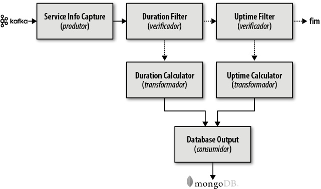
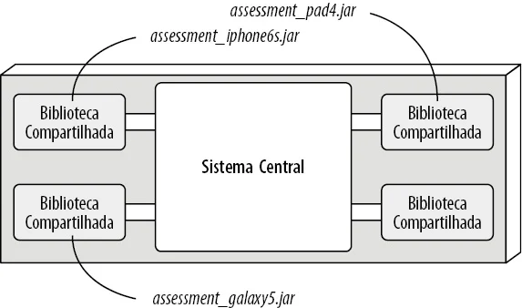

# 2 - Bimestre

## Aula - Circuit Breaker  

### Padrão do Disjuntor  

O **padrão Circuit Breaker** é utilizado para lidar com falhas em comunicações entre sistemas distribuídos.  
Quando um serviço remoto apresenta instabilidade ou falha, o disjuntor bloqueia temporariamente novas tentativas, evitando sobrecarga e permitindo a recuperação do sistema.  

Esse padrão aumenta a **resiliência** e a **estabilidade** das aplicações distribuídas.

---

## Contexto e Problema  

Em sistemas distribuídos, chamadas a serviços externos podem falhar devido a:
- Sobrecarga de recursos;  
- Conexões lentas ou indisponíveis;  
- Falhas transitórias ou persistentes.  

Falhas contínuas consomem recursos e podem gerar **falhas em cascata**.  
O objetivo do Circuit Breaker é interromper temporariamente novas tentativas até que o sistema tenha **condições reais de recuperação**.

---

## Solução  

O **Circuit Breaker** funciona como um proxy que controla as chamadas a serviços externos.  
Com base no histórico de falhas e sucessos, ele define se a operação será executada ou bloqueada.  

O funcionamento é baseado em três estados:

| Estado | Descrição |
|--------|------------|
| **Fechado** | Todas as solicitações são permitidas. Se o número de falhas ultrapassar o limite definido, o estado muda para **Aberto**. |
| **Aberto** | As chamadas são bloqueadas temporariamente. Após um período de espera, o disjuntor passa para o estado **Meio-Aberto**. |
| **Meio-Aberto** | Permite um número limitado de chamadas de teste. Se forem bem-sucedidas, o estado volta a **Fechado**; se falharem, retorna a **Aberto**. |

---

## Comparação com o Padrão Retry  

- **Retry:** tenta novamente a operação após falhas, com base em intervalos configurados.  
- **Circuit Breaker:** impede tentativas enquanto a probabilidade de sucesso é baixa.  

Os dois padrões podem ser combinados, desde que o Retry respeite o estado do disjuntor.

---

## Funcionamento dos Contadores  

- **Falhas (estado Fechado):** o contador é reiniciado periodicamente para evitar acionamentos indevidos.  
- **Sucessos (estado Meio-Aberto):** um número definido de chamadas bem-sucedidas reativa o disjuntor.  

Essa lógica garante a recuperação gradual do sistema e evita sobrecargas prematuras.

---

## Benefícios  

- Evita falhas em cascata.  
- Mantém a estabilidade e o desempenho.  
- Reduz o tempo de resposta durante falhas.  
- Preserva recursos do sistema.  

---

## Considerações de Implementação  

**Tratamento de Exceções:**  
O sistema deve tratar exceções retornadas quando o disjuntor está aberto, podendo usar cache ou mensagens alternativas.  

**Tipos de Falhas:**  
O disjuntor pode diferenciar falhas críticas (ex.: timeouts) de falhas transitórias, reagindo de forma adequada a cada caso.  

**Monitoramento:**  
Deve haver métricas para acompanhar taxas de falhas, tempos de resposta e estado atual do disjuntor.  

**Recuperação:**  
O tempo de bloqueio deve equilibrar estabilidade e agilidade. Um tempo muito curto causa oscilações; um tempo longo atrasa a retomada.  

**Testes e Ajustes:**  
Chamadas de teste controladas podem ser usadas para verificar a recuperação do serviço antes de liberar o tráfego normal.  

**Administração Manual:**  
O disjuntor pode ser configurado para permitir ativação ou desativação manual em situações críticas.  

---

## Quando Utilizar  

**Recomendado quando:**  
- Há dependências externas com instabilidade.  
- O sistema precisa se manter disponível durante falhas.  
- Deseja-se evitar sobrecarga e falhas em cascata.  

**Evite quando:**  
- O sistema é local e estável.  
- Há sobrecarga desnecessária causada pelo controle.  
- Mecanismos de retry já são suficientes.  

---

## Padrão no Contexto do Azure Well-Architected Framework  

| Pilar | Objetivo |
|--------|-----------|
| **Confiabilidade (RE)** | Evita sobrecarga em serviços com falha, mantendo o sistema disponível. |
| **Eficiência de Desempenho (PE)** | Impede tentativas desnecessárias, otimizando o uso de recursos. |

---

## Exemplo Prático  

**Cenário:**  
Em uma aplicação que utiliza o **Azure Cosmos DB**, durante picos de acesso o serviço retorna erros *HTTP 429 (Too Many Requests)*.  

**Solução:**  
1. O sistema monitora falhas e ativa o disjuntor após o limite configurado.  
2. Durante o período aberto, as requisições são bloqueadas e o cache é utilizado.  
3. Após o tempo de espera, o disjuntor entra em modo de teste (*Meio-Aberto*).  
4. Havendo sucesso nas chamadas, o disjuntor volta ao estado normal.  

**Resultado:**  
O sistema mantém disponibilidade e evita sobrecarga, garantindo recuperação controlada.  

# Aula – Padrão CQRS

## Definição
O **CQRS (Command Query Responsibility Segregation)** separa operações de **leitura** e **gravação** em modelos diferentes.  
Isso melhora desempenho, escalabilidade e segurança em sistemas complexos.

## Problema
Arquiteturas tradicionais usam um único modelo para CRUD.  
Com o crescimento do sistema, isso causa:
- Dificuldade de otimização;
- Bloqueios concorrentes;
- Consultas lentas;
- Riscos de segurança.

## Solução
Separar o sistema em:
- **Comandos:** alteram o estado (escrita);
- **Consultas:** apenas leem dados.

Cada modelo é otimizado para seu propósito e pode evoluir de forma independente.

---

## Modelos
1. **Mesma base de dados:** modelos de leitura e escrita usam o mesmo banco.  
2. **Bancos separados:** bancos distintos para leitura e gravação, exigindo sincronização via eventos.

---

## Benefícios
- Maior desempenho e escalabilidade;  
- Menos complexidade nas consultas;  
- Separação clara de responsabilidades;  
- Maior segurança e controle de acesso.

---

## Desvantagens
- Implementação mais complexa;  
- Risco de inconsistência entre modelos;  
- Maior esforço de sincronização.

---

## Quando Usar
- Sistemas com alta concorrência;  
- Domínios complexos;  
- Necessidade de escalabilidade e performance.

---

## Quando Evitar
- Aplicações simples ou CRUD básico;  
- Cenários sem alto volume de leitura ou gravação.

---

## CQRS + Event Sourcing
Combinar ambos permite histórico completo de alterações e reconstrução de estados, mas aumenta a complexidade e a consistência passa a ser eventual.

# Aula – Retry Pattern

## Definição
O **Retry Pattern** é um padrão de resiliência que define uma estratégia para **tentar novamente** uma operação que falhou temporariamente, antes de reportar erro ao sistema.  
Ele é útil para lidar com **falhas transitórias** em conexões de rede, bancos de dados ou serviços externos.

---

## Problema
Em sistemas distribuídos, falhas ocasionais são comuns devido a:
- Picos de carga no servidor;
- Conexões instáveis;
- Timeouts momentâneos.  

Tratar essas falhas como permanentes pode reduzir a disponibilidade do sistema.

---

## Solução
O padrão **Retry** executa novamente a operação falha após um intervalo de tempo pré-definido.  
Pode incluir:
- **Número máximo de tentativas**;
- **Intervalo fixo ou exponencial** entre as tentativas;
- **Cancelamento** após tempo limite.

O objetivo é dar tempo para que a falha transitória se resolva naturalmente.

---

## Estratégias de Retry
| Tipo | Descrição |
|------|------------|
| **Intervalo fixo** | Reexecuta a operação após um tempo constante. |
| **Exponencial Backoff** | Aumenta o intervalo a cada nova tentativa. |
| **Com jitter** | Adiciona variação aleatória ao intervalo para evitar sobrecarga simultânea. |

---

## Boas Práticas
- Definir **limite máximo de tentativas** para evitar sobrecarga.  
- Registrar logs de falhas e tentativas.  
- Usar **cancelamento** (timeout global) para impedir loops infinitos.  
- Avaliar se a operação é **idempotente** (não causa efeitos duplicados).  
- Integrar com outros padrões, como **Circuit Breaker**, para evitar novas tentativas em sistemas instáveis.

---

## Benefícios
- Aumenta a **resiliência** do sistema.  
- Melhora a **disponibilidade** durante falhas temporárias.  
- Reduz a necessidade de intervenção manual.

---

## Desvantagens
- Pode **aumentar a latência** da resposta.  
- Tentativas excessivas podem **sobrecargar serviços**.  
- Nem toda falha deve ser reexecutada (ex: erros de validação).

---

## Quando Usar
- Falhas transitórias em comunicações de rede.  
- Integrações com APIs externas.  
- Serviços que se recuperam rapidamente de sobrecarga.

---

## Quando Evitar
- Erros permanentes ou de lógica.  
- Operações críticas não idempotentes.  
- Sistemas com baixa tolerância a atrasos.

---

## Conclusão
O **Retry Pattern** é essencial para sistemas distribuídos e baseados em rede, garantindo que falhas temporárias não afetem a estabilidade geral.  
Quando bem configurado, ele reduz indisponibilidades e melhora a experiência do usuário sem comprometer recursos.

# Aula -  Arquitetura em Camadas 

## Conceito
A **arquitetura em camadas** organiza o sistema em níveis horizontais, cada um com funções específicas (apresentação, negócio, persistência e banco de dados). É amplamente usada por ser simples, familiar e de baixo custo. Surge naturalmente conforme a estrutura das equipes (lei de Conway).

## Estrutura Padrão
- **Camada de Apresentação**: interface com o usuário.
- **Camada de Negócio**: regras e lógica da aplicação.
- **Camada de Persistência**: comunicação com o banco de dados.
- **Camada de Banco de Dados**: armazenamento e recuperação de dados.

## Conceitos-Chave

### Separação de Responsabilidades
Cada camada cuida apenas da sua função, facilitando manutenção e especialização técnica, mas reduzindo a **agilidade**.

### Camadas Fechadas vs Abertas
- **Fechadas**: cada camada acessa apenas a imediatamente abaixo — favorece isolamento e baixo acoplamento.  
- **Abertas**: permitem pular camadas — melhor desempenho, mas aumentam o acoplamento.

### Camadas de Isolamento
Alterações em uma camada não afetam as outras. Isso permite trocar tecnologias (ex.: trocar JSF por React) sem grandes impactos.

## Adição de Novas Camadas
Pode-se inserir novas camadas, como **Serviços**, para organizar funcionalidades compartilhadas e controlar acessos entre camadas.

---

## Antipadrão Sinkhole
Ocorre quando as camadas apenas repassam dados sem aplicar lógica de negócio, gerando desperdício de processamento.  
É aceitável se for **menos de 20%** das requisições.

---

## Quando Usar
- Aplicações **pequenas ou simples**.  
- Projetos com **baixo orçamento** ou **prazo curto**.  
- Quando ainda não há definição clara de outro estilo arquitetural.

Evitar para sistemas grandes, que exigem **alta escalabilidade, agilidade e modularidade**.

---

## Pontos Fortes
- Simplicidade e baixo custo.  
- Facilidade de desenvolvimento.  
- Boa confiabilidade inicial.

## Pontos Fracos
- Baixa testabilidade e agilidade.  
- Dificuldade de manutenção e implantação.  
- Escalabilidade e desempenho limitados.  
- Fraca tolerância a falhas.

---

## Avaliação Geral

## Conclusão
A **arquitetura em camadas** é ideal para **projetos iniciais ou pequenos sistemas corporativos**, mas perde eficiência e flexibilidade à medida que cresce. É um bom ponto de partida, porém deve evoluir para estilos mais modulares em sistemas de maior porte.

# Aula -  Estilo de arquitetura em Pipeline

## Conceito
A **arquitetura Pipeline** é um estilo de arquitetura de software baseado em **processamento sequencial e unidirecional de dados**, em que cada etapa (ou filtro) executa uma função específica e passa o resultado para a próxima etapa.  
É muito usada em sistemas de **processamento de dados**, **ETL (Extract, Transform, Load)**, **EDI (Intercâmbio Eletrônico de Dados)** e **orquestração de mensagens** (como Apache Camel ou Apache Kafka).

---

## Estrutura Básica
Um pipeline é formado por **filtros** e **canais**:

- **Produtores:** capturam ou geram dados (ex: Service Info Capture).  
- **Verificadores:** filtram dados de acordo com regras (ex: Duration Filter, Uptime Filter).  
- **Transformadores:** processam ou modificam os dados (ex: Duration Calculator, Uptime Calculator).  
- **Consumidores:** armazenam ou enviam os resultados (ex: Database Output).

*Exemplo:*  
Dados de telemetria são enviados via **Kafka** → processados por filtros → transformados → armazenados em um banco de dados.

---

## Extensibilidade
A arquitetura é **modular**, permitindo adicionar novos filtros facilmente.  
Exemplo: adicionar um filtro após o *Uptime Filter* para coletar nova métrica (como tempo de espera do banco de dados).

---

## Classificação das Características

| Característica             | Avaliação (★) | Descrição                                                                 |
|-----------------------------|----------------|---------------------------------------------------------------------------|
| **Custo / Simplicidade**   | ★★★★★          | Arquitetura monolítica simples e barata de implementar.                   |
| **Modularidade**           | ★★★★★          | Separação clara de responsabilidades entre filtros.                       |
| **Implementabilidade**     | ★★★☆☆          | Boa, mas depende do monólito completo.                                   |
| **Testabilidade**          | ★★★☆☆          | Testes modulares possíveis, mas ainda é preciso testar o monólito inteiro.|
| **Confiabilidade**         | ★★★☆☆          | Média, sem dependência de rede, mas falhas locais afetam todo o sistema. |
| **Escalabilidade**         | ★☆☆☆☆          | Baixa, pois o monólito limita o crescimento.                             |
| **Elasticidade**           | ★☆☆☆☆          | Muito baixa — difícil adaptar partes específicas à demanda.              |
| **Tolerância a falhas**    | ★☆☆☆☆          | Queda em um filtro pode afetar todo o pipeline.                          |
| **Disponibilidade**        | ★★☆☆☆          | Impactada por longos tempos de reinicialização (alto MTTR).              |

---

## Pontos Fortes
- Simplicidade e baixo custo.  
- Modularidade entre os filtros.  
- Facilidade de entendimento e manutenção.

## Pontos Fracos
- Monolítico → baixa escalabilidade e tolerância a falhas.  
- Testabilidade e deploy complexos, pois requerem a reinstalação do sistema todo.  
- Alta dependência interna (um erro pode afetar tudo).

---

# Aula - Estilo de arquitetura em Pipeline

## Conceito
A **arquitetura Microkernel** (também chamada de **arquitetura de plug-in**) é um estilo de arquitetura em que a aplicação é dividida em duas partes principais:
1. **Sistema Central (Core System)** — contém a funcionalidade mínima necessária para o funcionamento básico do sistema.
2. **Componentes de Plug-in** — módulos independentes que estendem, personalizam ou modificam o comportamento do sistema central.

É muito usada em **aplicações baseadas em produto** (como IDEs, navegadores e softwares corporativos configuráveis), mas também em **sistemas corporativos** que precisam de **alta extensibilidade e personalização**.

---

## Topologia
A estrutura básica da arquitetura microkernel é **monolítica e modular**, composta por:
- **Sistema Central:** fornece o núcleo da aplicação e o fluxo principal de execução.
- **Plug-ins:** adicionam funcionalidades, regras ou comportamentos específicos.
- **Registro:** lista e gerencia os plug-ins disponíveis e suas interfaces.
- **Contratos:** definem como os plug-ins se comunicam com o sistema central.

---

## Sistema Central
- Contém apenas as funcionalidades essenciais (“mínimo necessário”).
- Pode ser implementado como uma **arquitetura em camadas** ou como um **bloco monolítico modular**.
- Serve como ponto de controle, delegando tarefas especializadas aos plug-ins.
- Exemplo:  
  - No **Eclipse**, o sistema central é apenas o editor básico.  
  - Os plug-ins (como depuradores, compiladores e suporte a linguagens) adicionam o restante das funcionalidades.

---

## Componentes de Plug-in
- São **autônomos e independentes**, contendo regras ou recursos específicos.
- Devem ser **isolados entre si**, sem dependências diretas.
- Podem ser implementados como:
  - **Bibliotecas compartilhadas** (JAR, DLL, Gem);
  - **Namespaces ou pacotes** (ex: `app.plugin.assessment.iphone6s`);
  - **Serviços remotos** acessados via **REST ou mensageria**.
- O **acesso remoto** aumenta o desacoplamento, mas traz mais complexidade, latência e risco de falha.

Os plug-ins podem ter seus próprios **bancos de dados locais**, mas o **acesso central ao banco principal** deve ser controlado pelo sistema central.

---

## Registro e Contratos
- O **registro de plug-ins** contém informações sobre cada módulo, como nome, tipo de contrato e protocolo de comunicação.
- Pode ser simples (um mapa interno) ou complexo (usando ferramentas como **ZooKeeper** ou **Consul**).
- Os **contratos** definem o comportamento padrão e os dados de entrada/saída entre o sistema central e o plug-in.
- Quando plug-ins são feitos por terceiros, **adaptadores** podem ser usados para compatibilizar contratos diferentes.

---

## Exemplos e Casos de Uso
- **Eclipse IDE, Jira, Jenkins, navegadores (Chrome, Firefox)** — plug-ins adicionam funcionalidades específicas.
- **Sistema de processamento de sinistros (seguros):**  
  - Cada jurisdição pode ter um conjunto de regras implementadas em plug-ins independentes.
- **Software de imposto (ex: formulário 1040 nos EUA):**  
  - Cada formulário ou planilha é um plug-in independente, enquanto o formulário principal é o sistema central.

---

## Classificação das Características da Arquitetura

| Característica             | Avaliação (★) | Descrição                                                                 |
|-----------------------------|----------------|---------------------------------------------------------------------------|
| **Custo / Simplicidade**   | ★★★★★          | Estrutura simples e barata de desenvolver e manter.                       |
| **Testabilidade**          | ★★★☆☆          | Plug-ins isolados facilitam testes modulares.                             |
| **Implementabilidade**     | ★★★☆☆          | Implementação média, mas de baixa complexidade.                           |
| **Confiabilidade**         | ★★★☆☆          | Média; isolamento de falhas por plug-in melhora estabilidade.             |
| **Modularidade**           | ★★★☆☆          | Boa, com isolamento e independência entre módulos.                        |
| **Extensibilidade**        | ★★★☆☆          | Fácil de adicionar ou remover plug-ins sem alterar o sistema central.     |
| **Performance**            | ★★★☆☆          | Acima da média; pode ser ajustada desativando plug-ins desnecessários.    |
| **Escalabilidade**         | ★☆☆☆☆          | Baixa; o sistema central é um gargalo.                                   |
| **Elasticidade**           | ★☆☆☆☆          | Limitada devido à estrutura monolítica.                                  |
| **Tolerância a falhas**    | ★☆☆☆☆          | Fraca; falha no núcleo afeta toda a aplicação.                            |

---

## Pontos Fortes
- Simplicidade e baixo custo de desenvolvimento.
- Boa **modularidade** e **testabilidade**.
- Facilidade para **extensão e customização**.
- Redução da **complexidade ciclomática** no sistema central.
- Ideal para produtos que exigem **personalização** (ex: IDEs, sistemas corporativos configuráveis).

---

## Pontos Fracos
- **Escalabilidade e tolerância a falhas** limitadas por ser monolítico.  
- Se o **sistema central falhar**, toda a aplicação para.  
- O uso de **plug-ins remotos** adiciona latência e complexidade.  
- A **dependência de um núcleo único** pode causar gargalos de desempenho.

---

## Conclusão
A **arquitetura Microkernel** é ideal para **sistemas personalizáveis, extensíveis e modulares**, como ferramentas de desenvolvimento e produtos configuráveis.  
Permite **adicionar, remover ou atualizar funcionalidades** sem modificar o núcleo da aplicação.  
No entanto, **não é adequada** para aplicações que exigem **alta escalabilidade**, **tolerância a falhas** ou **execução distribuída**, devido à sua **natureza monolítica**.
