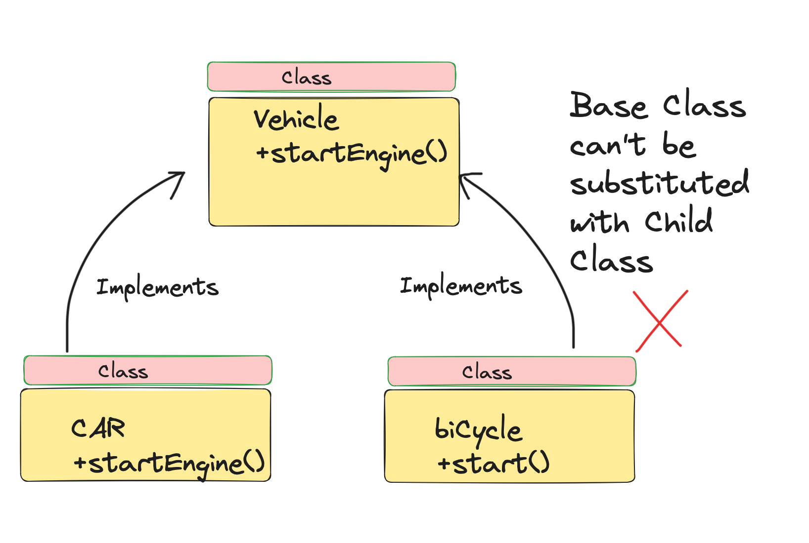

# Aula 14/08/2025 - SOLID
*Baseada nos livros "Padrões de Projeto", "Engenharia de Software Moderna" e referências do site Design Patterns Guru*

---

## Capítulo 1 - Liskov Substitution Principle (Princípio de Substituição de Liskov)

"Se S é um subtipo de T, então objetos do tipo T em um programa podem ser substituídos por objetos do tipo S sem alterar nenhuma das propriedades desejáveis do programa (correção, tarefas realizadas, etc.)."  
— **Barbara Liskov**

Esse princípio estabelece que uma subclasse deve ser capaz de substituir sua superclasse sem quebrar o comportamento esperado do sistema.  
Se isso não for possível, significa que a herança foi aplicada de maneira incorreta.

---

## Capítulo 2 - Exemplo de má implementação

No exemplo abaixo, **Carro** e **Bicicleta** são ambos considerados **Veículos**.  
Porém, se a classe `Veiculo` define que todo veículo deve ter um **motor**, a **Bicicleta** não pode implementar corretamente essa lógica, pois não possui motor.  

Isso quebra o princípio de Liskov, já que a bicicleta não pode substituir o veículo sem gerar inconsistência.  

---

## Capítulo 3 - Resolução do problema com LSP

A solução é reorganizar a hierarquia de classes:  
- Criar uma superclasse **Veículo** mais genérica  
- Separar em **Veículo Motorizado** e **Veículo Não Motorizado**  
- Fazer com que **Carro** herde de **Veículo Motorizado** e **Bicicleta** de **Veículo Não Motorizado**  

Assim, ambos podem substituir sua respectiva superclasse sem problemas.  

---

## Capítulo 4 - Relação com Padrões de Projeto

Os **Padrões de Projeto** frequentemente se apoiam no **Princípio de Substituição de Liskov**.  
Por exemplo:
- **Strategy**: garante que diferentes implementações possam substituir a interface sem alterar o cliente  
- **Template Method**: define um esqueleto de algoritmo que pode ser substituído por subclasses de forma segura  
- **Factory Method**: cria objetos que respeitam contratos definidos por interfaces, mantendo a substituição coerente  

---

## Conclusão da Aula
Na aula de 14/08/2025 vimos:  
- O conceito do **Princípio de Substituição de Liskov**  
- Um **exemplo prático** de violação do princípio (carro e bicicleta)  
- A **solução com hierarquia ajustada** para respeitar a substituição  
- A importância do LSP para a aplicação correta de **padrões de projeto**  

**Referências:**  
- Livro *Padrões de Projeto*  
- Livro *Engenharia de Software Moderna*  
- Site *Design Patterns Guru*  

