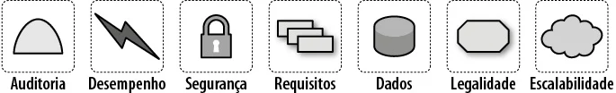
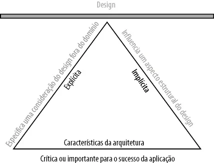

# Aula 04/10 - Características da Arquitetura de Software

## Conceito de Arquitetura de Software

A **arquitetura de software** representa as principais decisões estruturais de um sistema, abrangendo tanto os requisitos do domínio (funcionais) quanto as **características da arquitetura**, que tratam de aspectos **não diretamente relacionados à funcionalidade**, mas fundamentais para o sucesso da aplicação.  

Enquanto o **design e a codificação** se concentram na implementação detalhada, a arquitetura foca nas **decisões amplas que impactam toda a estrutura do sistema**, como desempenho, segurança, manutenibilidade e escalabilidade.

## Diferença entre Arquitetura, Design e Codificação

- **Codificação:** Implementação direta das funcionalidades do sistema em código.  
- **Design:** Estruturação detalhada de componentes, classes e interações.  
- **Arquitetura:** Definição das diretrizes e estruturas fundamentais que orientam o design e a codificação.  

A principal diferença está na **escala das decisões**: a arquitetura se preocupa com o todo, enquanto o design e a codificação se concentram em partes específicas.

---

## Características da Arquitetura

As **características da arquitetura** (também chamadas de requisitos arquiteturais) representam **considerações de design fora do domínio**, ou seja, tudo o que o software precisa atender além das suas funcionalidades diretas.  

Embora sejam conhecidas por muitos como **requisitos não funcionais** ou **atributos de qualidade**, esses termos podem causar uma interpretação equivocada — por isso, o termo **características da arquitetura** é mais adequado, pois reforça sua importância para o sucesso do sistema.

### Critérios de uma Característica da Arquitetura

Segundo a definição da **Figura 4-2**, uma característica da arquitetura deve atender **três critérios principais** e pode ser complementada por modificadores:

1. **Especifica uma consideração de design fora do domínio**  
   - Enquanto os requisitos definem *o que* o sistema deve fazer, as características da arquitetura definem *como* e *por que* certas decisões de design são tomadas.  
   - Exemplo: definir um nível mínimo de desempenho, evitar débito técnico, ou impor restrições de segurança.  
   - Muitas vezes, essas características são **implícitas**, não aparecendo em documentos de requisitos formais.  

2. **Influencia um aspecto estrutural do design**  
   - Uma característica da arquitetura tem impacto direto na **estrutura do sistema**.  
   - Exemplo prático:  
     - Se o sistema **terceiriza o processamento de pagamentos**, o design exige apenas práticas básicas de segurança.  
     - Mas se o sistema **realiza o processamento internamente**, o arquiteto deve projetar módulos e serviços específicos para isolar e proteger dados sensíveis.  
   - Isso demonstra que certas características (como segurança) afetam o **design e a estrutura** em níveis diferentes, dependendo do contexto.

3. **É essencial ou importante para o sucesso da aplicação**  
   - Nem todas as características devem ser implementadas — cada uma adiciona complexidade.  
   - Cabe ao arquiteto **selecionar as mais relevantes** para o sucesso do sistema.  
   - As características **implícitas** (como disponibilidade, confiabilidade e segurança) raramente são escritas, mas são fundamentais.  
   - As **explícitas** aparecem diretamente nos documentos de requisitos.

A **Figura 4-2** é representada por um triângulo, simbolizando que os três critérios se apoiam mutuamente e formam a base para o design do sistema.  
Essa interdependência leva aos **trade-offs**, pois melhorar uma característica geralmente impacta negativamente outra.

---

## Categorias de Características da Arquitetura

As características podem ser divididas em **três grandes grupos**:

### 1. Características Operacionais da Arquitetura
Relacionadas ao **comportamento em execução** do sistema.

| Termo | Definição |
|-------|------------|
| **Disponibilidade** | Tempo que o sistema precisa estar ativo (ex.: 24/7 requer estratégias de redundância). |
| **Continuidade** | Capacidade de recuperação de desastres. |
| **Desempenho** | Tempo de resposta, throughput e testes de estresse. |
| **Recuperabilidade** | Tempo e estratégia para restaurar o sistema após falhas. |
| **Confiabilidade / Segurança** | Avaliação do impacto de falhas ou riscos críticos. |
| **Robustez** | Capacidade de resistir a erros, falhas de rede ou energia. |
| **Escalabilidade** | Capacidade de manter o desempenho com aumento de usuários ou requisições. |

Essas características se sobrepõem com práticas de **DevOps** e **operações**, pois influenciam a infraestrutura e o monitoramento.

---

### 2. Características Estruturais da Arquitetura
Focadas na **qualidade interna e organizacional** do código e componentes.

| Termo | Definição |
|-------|------------|
| **Configuração** | Facilidade de alterar parâmetros sem necessidade de código. |
| **Extensão** | Facilidade de adicionar novas funcionalidades. |
| **Instalabilidade** | Facilidade de instalação em diferentes plataformas. |
| **Reutilização** | Capacidade de reaproveitar componentes em outros sistemas. |
| **Localização** | Suporte a múltiplos idiomas, formatos e moedas. |
| **Manutenção** | Facilidade de aplicar correções e melhorias. |
| **Portabilidade** | Capacidade de executar em diferentes plataformas. |
| **Suporte** | Nível de registro e ferramentas necessárias para depuração. |
| **Atualização** | Facilidade de atualizar versões sem afetar usuários. |

---

### 3. Características Transversais da Arquitetura
Englobam restrições e requisitos que afetam o sistema como um todo.

| Termo | Definição |
|-------|------------|
| **Acessibilidade** | Inclusão de usuários com deficiências visuais, auditivas etc. |
| **Armazenamento** | Políticas de retenção e exclusão de dados. |
| **Autenticação** | Garantia de identidade do usuário. |
| **Autorização** | Controle de acesso a funções e dados. |
| **Legalidade** | Conformidade com leis (LGPD, GDPR, Sarbanes-Oxley). |
| **Privacidade** | Proteção de dados contra acesso indevido. |
| **Segurança** | Criptografia de dados, autenticação e proteção de comunicações. |
| **Usabilidade / Viabilidade** | Facilidade de uso e aprendizado pelos usuários. |

---

## Exemplo: “Como na Itália”

Um caso famoso ilustra a importância das características contextuais da arquitetura.  
Uma empresa que sofreu perda de comunicação com suas filiais italianas passou a exigir que todos os sistemas futuros garantissem resiliência completa em caso de perda de conexão com uma região.  

Essa exigência ficou conhecida como **Italy-ility (Como na Itália)** — uma combinação única de **disponibilidade**, **recuperabilidade** e **resiliência**.

---

## Definições ISO de Características da Arquitetura

A **ISO** (Organização Internacional para Padronização) define várias categorias que se sobrepõem às discutidas:

| Categoria | Definição |
|------------|-----------|
| **Eficiência do desempenho** | Relação entre desempenho e recursos usados. Inclui tempo de resposta e taxa de transferência. |
| **Compatibilidade** | Capacidade de interoperar e coexistir com outros sistemas. |
| **Usabilidade** | Facilidade e satisfação no uso do sistema. Inclui aprendizado e acessibilidade. |
| **Confiabilidade** | Funcionamento contínuo e seguro sob condições específicas. Inclui maturidade, disponibilidade e tolerância a falhas. |
| **Segurança** | Proteção de dados e controle de acesso. Inclui confidencialidade, integridade e autenticidade. |
| **Manutenibilidade** | Facilidade de modificar, testar e melhorar o software. Inclui modularidade e testabilidade. |
| **Portabilidade** | Capacidade de migração para diferentes ambientes de hardware e software. |

A ISO também lista a **Adequação Funcional**, que representa o grau em que o sistema atende às necessidades dos usuários, mas essa pertence ao domínio funcional — **não é uma característica da arquitetura**.

---

## Ambiguidades e Terminologia

Um desafio constante na arquitetura de software é a **falta de padronização nos termos**.  
Empresas frequentemente criam definições próprias, o que causa confusão e inconsistência.  

Seguir princípios do **Domain-Driven Design (DDD)** ajuda a criar uma **linguagem universal** dentro da equipe, reduzindo mal-entendidos.

---

## Trade-offs e a Arquitetura “Menos Pior”

Cada característica da arquitetura adiciona complexidade e pode afetar outras negativamente.  
Por exemplo:
- **Mais segurança** → pode reduzir o **desempenho**.  
- **Mais disponibilidade** → pode aumentar o **custo** e a **complexidade**.  

Assim, arquitetos devem buscar **equilíbrio**, não perfeição:
> “Nunca mire na melhor arquitetura, mas na arquitetura menos pior.”

Projetar uma arquitetura **iterativa e adaptável** é a melhor forma de lidar com incertezas, permitindo ajustes conforme novas necessidades surgem — um princípio essencial do **desenvolvimento ágil**.

---

## Conclusão

Características excessivas da arquitetura levam a soluções genéricas que tentam resolver todo problema de negócio e essas arquiteturas raramente funcionam porque fica difícil de lidar com o design.

Isso sugere que os **arquitetos devem projetar a arquitetura como sendo a mais iterativa possível**. Se você conseguir fazer mudanças na arquitetura com mais facilidade, poderá se estressar menos descobrindo a coisa correta e exata na primeira tentativa. Uma das lições mais importantes do desenvolvimento ágil de software é o valor da iteração; isso vale para todos os níveis de desenvolvimento do software, inclusive a arquitetura.